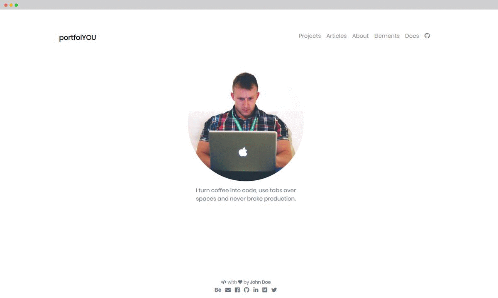

    <h1>portfolio-template</h1>
    <i>A beautiful portfolio Jekyll theme that works with GitHub Pages.</i>
      
    
    © 2019 portfolio-template, licensed under the <a href="./LICENSE">MIT License</a>.

